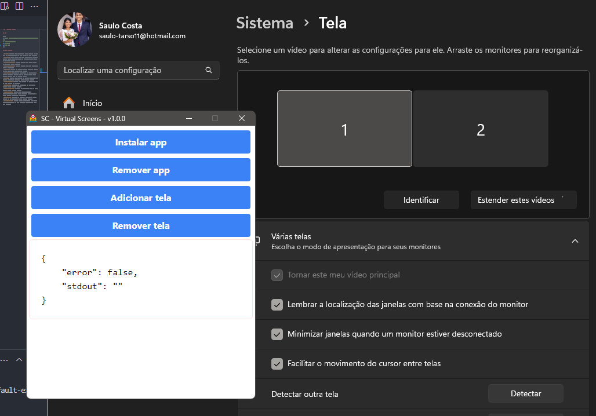

# SC - Virtual Screens



## Use

```sh
git clone https://github.com/saulotarsobc/sc-virtual-screens.git;
cd sc-virtual-screens;
npm install;
npm run dev;
```

### NPM Commands

- **dev:** Initiates the application, first building it with `npm run build-electron` and then running it with Electron.
- **clean:** Removes output and build directories, including `dist`, `main`, `frontend/out`, and `frontend/.next`, using the `rimraf` package.
- **build-frontend:** Compiles frontend code using Next.js and generates build artifacts.
- **build-electron:** Compiles backend code using TypeScript (`tsc -p backend`).
- **build:** Executes the cleaning process (`npm run clean`) and then builds both frontend and backend.
- **pack-app:** Packages the application for distribution, building frontend, backend, and the overall package using Electron Builder with the `--dir` option.
- **dist:** Performs the cleaning and building process, then creates distribution artifacts using Electron Builder.
- **type-check:** Performs type checking for TypeScript code in both frontend and backend.
- **publish:** Publishes the application for the Windows platform using Electron Builder.
- **publish-linux:** Publishes the application for the Linux platform using Electron Builder.
- **postinstall:** Executes the `electron-builder install-app-deps` command after dependency installation to ensure correct application dependencies.
- **release:** Initiates the process of creating a release package for the application using Electron Builder.
- **libs-update:** Updates project dependencies using `ncu` (npm-check-updates) and then reinstalls dependencies using `npm install`.
